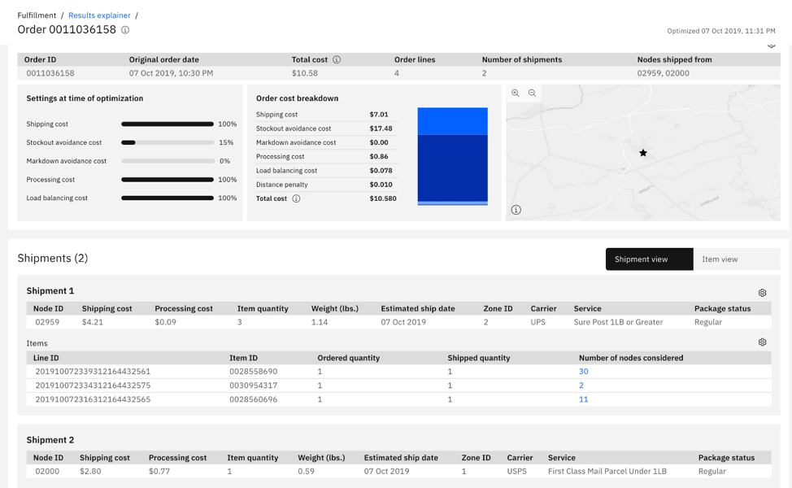
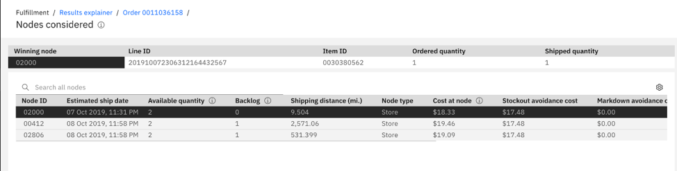

# Gain Transparency into Fulfillment  Decisions with Results Explainer

In my [previous blog](https://community.ibm.com/community/user/supplychain/blogs/anum-valliani1/2019/08/28/take-the-next-step-add-ai-to-ibm-order-management?CommunityKey=dd15f3ff-b6c6-4b0a-8248-169fc0c994ed&Tab=), I introduced IBM Sterling Fulfillment Optimizer with Watson and provided answers to five of the most frequently asked questions. Once clients have implemented this AI-powered solution to optimize fulfillment, they tend to have another question: Why did Sterling Fulfillment Optimizer make the decisions that it did? In this blog, we’ll look at what’s in Watson’s head.

When an order is sent to Sterling Fulfillment Optimizer, the order goes through many rules, configurations, constraints and cost optimization comparisons to determine the best option to fulfill the order. Sometimes, as a user, the recommendation intuitively feels right, but other times it may not – particularly if you’re dealing with complex orders and a complex fulfillment network. If an order is placed in Chicago and Sterling Fulfillment Optimizer recommends that different order lines for the order be fulfilled from nodes in Los Angeles and Dallas, you may have difficulty understanding why that was the best choice to maximize profits.

What isn’t immediately evident is that behind the scenes Sterling Fulfillment Optimizer is using big data analytics, AI and machine learning, to look for trends and patterns. It analyzes sell-through patterns, rate of sale data and probability of sale to determine the risk of stockouts or markdowns for each SKU node combination, and automatically calculates the lowest overall fulfillment cost at that moment. This is critical because that moment in time is always changing as the fulfillment network and sell-through patterns continuously change and business preferences may change as well. [Remember, in the last blog I discussed how you may decide to prioritize one or more factors over the total cost due to promotions or seasonality.] In this example where the order is fulfilled from Los Angeles and Dallas, the solution determined, based on visibility into real-time data and balancing multiple factors simultaneously, that if the order had been fulfilled from a single node in Chicago – which at that moment was very low on inventory – the risk of stockout would have been high.

The AI and machine learning factors are combined with other factors like product weights, carrier availability and store backlog to determine the final decision. As we can imagine, applying AI with other variables further adds to the complexity in understanding why a certain decision was made. We believe AI-enabled solutions should address this challenge by providing full transparency into the decision-making process and explanations as to why recommendations being made are optimal. Without a deep level of understanding, communication and reporting is incredibly difficult for users. To make it easy for you to gain the level of understanding you need, I’m excited to tell you about additional capabilities in Sterling Fulfillment Optimizer.

### Getting to <i>Why</i> with Results Explainer

To help our clients see what’s in Watson’s head, we’ve introduced Results Explainer, a self-service capability that provides details about the optimization for an order. Take a look at the intuitive Results Explainer UI in Figure 1.

&ensp;

<figure>
<html>
<head>
<meta name="viewport" content="width=device-width, initial-scale=1">
</head>
<body>

</body>
</html>
<figcaption>Fig.1:  Easily toggle between a Shipment or Item level view for each  order that  is "looked up".</figcaption>
</figure>

&ensp;

For each order, Results Explainer provides the following information with an explanation of why a decision was made:

<ul>
<li>Weighted preferences of business objectives for optimization at the time of order.</li>
<li>The total optimization cost for the order, which is the sum of the shipping cost, processing cost, load balancing cost, distance penalty cost, stockout cost and markdown cost based on your business settings at the time of optimization.</li>
<li>Winning node(s) for an order and information for each, including:
	<ul>
		<li>Costs</li>
		<li>On hand inventory at the time of optimization</li>
		<li>Backlog at ship node</li>
		<li>Carriers that can fulfill the order</li>
		<li>Units selected for the winning Node</li>
	</ul>
</li>
<li>Shipment details which include:
	<ul>
		<li>Whether it is a regular, delayed, or upgraded shipment</li>
		<li>Weight of shipment</li>
		<li>Items included in the shipment</li>
		<li>Carrier and Carrier service name</li>
		<li>Distance between ship node and ship to address</li>
		<li>Cost</li>
		<li>Number of additional candidates considered</li>
	</ul>
</li>
</ul>

For reporting purposes, the UI also makes it easy to search on all orders for a specific period and then drill down for more details on individual orders or shipments as needed. For example, you can even drill down into detailed information about each alternate node [see Figure 2] to understand how the winning node (the node Sterling Fulfillment Optimizer settled on) was actually chosen for a given line item.

&ensp;

<figure>
<html>
<head>
<meta name="viewport" content="width=device-width, initial-scale=1">
</head>
<body>

</body>
</html>
<figcaption>Fig.2:  Gain visibility into node details for an order to understand why a specific node was chosen.</figcaption>
</figure>

&ensp;

With all this information at your fingertips about the orders that are processed, you can immediately understand why a recommendation is optimal without logging a ticket and relying on IBM support to provide the details of the calculations. In fact, Results Explainer provides faster and greater transparency into decisions than traditional rules-based systems, where the burden is on the user to have a deep understanding of the rules in order to figure out the results.

### How to get started

The Results Explainer User Interface makes it easy to use. Learn more about Results Explainer and stay abreast of the latest updates [here](https://www.ibm.com/support/knowledgecenter/SSZMC6/com.ibm.help.orderoptimizer.doc/Overview/ResultsExplainer.html).

To learn more about Sterling Fulfillment Optimizer, visit our [product page](https://www.ibm.com/us-en/marketplace/omni-channel-fulfillment). More technical documentation and details are available [here](https://developer.ibm.com/api/view/orderoptimizer-prod:ibm-watson-order-optimizer:title-IBM_Watson_Order_Optimizer#Overview).

If you have more questions, we encourage you to post them in the [forum](https://community.ibm.com/community/user/supplychain/communities/community-home/digestviewer?communitykey=dd15f3ff-b6c6-4b0a-8248-169fc0c994ed&tab=digestviewer) and we’ll address them as quickly as possible.
